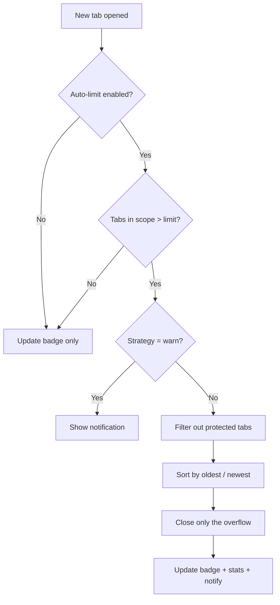
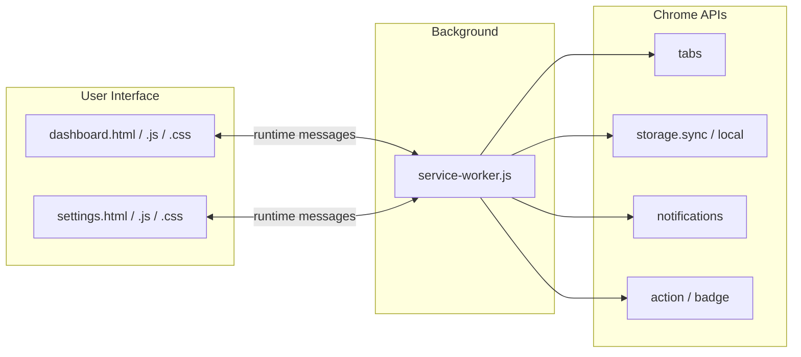

<a name="readme-top"></a>

<div align="center">


# 🟡 PacTab — Munch the clutter, save the RAM

**Chomp your tab clutter. Keep the tabs that matter. Stop Chrome from eating your RAM.**

A modern, dependency-free Chrome extension (Manifest V3) with a live tab dashboard,
smart auto-limits, duplicate cleanup, domain insights, and protected tabs — all
wrapped in a clean, theme-aware UI.


</div>

---

## 📖 Table of Contents

- [Why PacTab?](#-why-pactab)
- [Features](#-features)
- [Screenshots](#-screenshots)
- [Installation](#-installation)
- [Usage](#-usage)
- [Settings Reference](#-settings-reference)
- [How It Works](#-how-it-works)
- [Architecture](#-architecture)
- [Project Structure](#-project-structure)
- [Privacy & Permissions](#-privacy--permissions)
- [Tech Stack](#-tech-stack)
- [Roadmap](#-roadmap)
- [Contributing](#-contributing)
- [License](#-license)

---

## 🤔 Why PacTab?

We have all been there: dozens of tabs open, the browser crawling, and no idea
which tabs are even still useful. Most "tab limiters" just **silently kill tabs** —
which is terrifying when you lose something important.

### 🧠 The hidden cost: Chrome eats your RAM

Every open tab is its own little process. Chrome isolates tabs for security and
stability, but that means **each tab consumes real memory** — often **tens to
hundreds of megabytes** depending on the page. Open 30–40 heavy tabs (think
Gmail, YouTube, Docs, Figma, social feeds) and Chrome can quietly devour
**multiple gigabytes of RAM**. The result:

- 🐌 Your whole machine slows down as RAM fills up and the OS starts swapping.
- 🔋 Battery drains faster from background tabs doing work you forgot about.
- 🌀 Switching tabs gets laggy, and Chrome may even discard tabs on its own.

Just like Pac-Man gobbling up everything in sight, **a wall of open tabs gobbles
up your RAM** 🟡👾. PacTab flips the script — it's the Pac-Man that **eats the
clutter for you**, so fewer pointless tabs means **less memory used, a snappier
browser, and longer battery life**.

**PacTab is different.** It keeps you within a tab budget *intelligently*:

- It **never** closes pinned tabs, tabs playing audio, your active tab, or any
  domain you whitelist.
- You choose the strategy — close the **oldest**, the **newest**, or just get a
  **warning**.
- It gives you a **live dashboard** so you are always in control, not surprised.

<p align="right">(<a href="#readme-top">back to top</a>)</p>

---

## ✨ Features

| | Feature | Description |
| --- | --- | --- |
| 📊 | **Live tab dashboard** | Every open tab grouped by domain, with favicons, titles, and one-click switch / close. |
| 🎚️ | **Configurable budget** | Set your own limit (3–60), counted **per window** or **across all windows**. |
| 🧠 | **Smart strategies** | When over budget, close **oldest**, close **newest**, or **warn only**. |
| 🛡️ | **Protected tabs** | Pinned, audible, active, and **whitelisted domains** are never auto-closed. |
| 🧹 | **Duplicate cleanup** | Collapse duplicate tabs across all windows with one click. |
| 🔍 | **Instant search** | Filter open tabs by title or URL as you type. |
| 🔢 | **Live badge** | The toolbar icon shows your current tab count — and turns red when over budget. |
| 🔔 | **Notifications & stats** | Optional alerts plus running counters for auto-closed & de-duplicated tabs. |
| 🌗 | **Light & dark themes** | Automatically follows your system preference. |
| 🔒 | **100% local** | No accounts, no servers, no tracking. Everything runs on your machine. |

<p align="right">(<a href="#readme-top">back to top</a>)</p>

---

## 📸 Screenshots

> Replace these placeholders with real screenshots after loading the extension.

| Dashboard | Settings |
| --- | --- |
| `docs/dashboard.png` | `docs/settings.png` |

<p align="right">(<a href="#readme-top">back to top</a>)</p>

---

## 🚀 Installation

PacTab is a standard unpacked Chrome extension — **no build step required**.

1. **Get the code**
   ```sh
   git clone https://github.com/<your-username>/pactab.git
   cd pactab
   ```
2. Open Chrome and go to `chrome://extensions/`.
3. Toggle **Developer mode** (top-right corner) **on**.
4. Click **Load unpacked** and select the project folder.
5. Pin **PacTab** to your toolbar (puzzle-piece icon → pin).

> Works in any Chromium-based browser that supports Manifest V3 — Chrome, Edge,
> Brave, Opera, and Arc.

<p align="right">(<a href="#readme-top">back to top</a>)</p>

---

## 🧭 Usage

1. Click the **PacTab** toolbar icon to open the dashboard.
2. Check your **usage bar** and stats (windows, duplicates, domains, auto-closed).
3. Use the quick actions:
   - **Dedupe** — close duplicate tabs across all windows.
   - **Tidy** — apply your tab limit immediately.
   - **Search** — type to filter the tab list.
4. **Click any tab** to jump to it, or **hover and press ✕** to close it.
5. Click the **gear icon** to open **Settings** and configure your budget,
   strategy, protected tabs, and whitelist.

Background auto-limiting works automatically — **no need to restart Chrome**.

<p align="right">(<a href="#readme-top">back to top</a>)</p>

---

## ⚙️ Settings Reference

| Setting | Description | Default |
| --- | --- | --- |
| **Enable auto-limit** | Master switch for background enforcement | `On` |
| **Maximum tabs** | Tab budget before PacTab acts | `15` |
| **Counting scope** | Count tabs `per window` or across `all windows` | `Per window` |
| **Strategy** | `Close oldest` · `Close newest` · `Warn only` | `Close oldest` |
| **Protect pinned** | Never close pinned tabs | `On` |
| **Protect audible** | Never close tabs playing audio | `On` |
| **Protect active** | Never close the focused tab | `On` |
| **Whitelisted domains** | Domains that are always protected | `Empty` |
| **Notifications** | Notify when tabs are auto-closed | `On` |
| **Live badge** | Show tab count on the toolbar icon | `On` |

Settings are stored in `chrome.storage.sync`, so they **roam with your Chrome
profile** across devices.

<p align="right">(<a href="#readme-top">back to top</a>)</p>

---

## 🔧 How It Works

The background **service worker** is the brain of the extension:

1. It listens for `tabs.onCreated` (and removal/update) events.
2. When a new tab pushes you over your budget within the active **scope**, it:
   - Gathers all tabs in scope.
   - Filters out every **protected** tab (pinned, audible, active, whitelisted).
   - Sorts the remaining "closable" tabs by your chosen **strategy**
     (`oldest` = lowest tab id first, `newest` = highest first).
   - Closes **only the overflow** — never more than needed.
3. It keeps the toolbar **badge** in sync and optionally fires a **notification**.
4. The **dashboard** and **settings** pages talk to the worker through a small
   `chrome.runtime` message API (`getState`, `saveSettings`, `closeDuplicates`,
   `enforceNow`, etc.).



<p align="right">(<a href="#readme-top">back to top</a>)</p>

---

## 🏛️ Architecture

PacTab follows a simple, robust **message-driven** architecture. The service
worker owns all state and logic; the UI pages are thin clients.



**Design principles**

- **Single source of truth** — all settings and enforcement live in the worker.
- **Least privilege** — only `tabs`, `storage`, and `notifications` permissions.
- **No dependencies** — pure HTML/CSS/JS; nothing to build or audit.
- **Resilient** — defensive `try/catch` around tab operations that may race.

| Message | Sent by | Action |
| --- | --- | --- |
| `getState` | Dashboard / Settings | Returns settings, tabs, window count, stats |
| `saveSettings` | Settings | Persists settings and re-enforces |
| `activateTab` | Dashboard | Focuses a tab and its window |
| `closeTab` / `closeTabs` | Dashboard | Closes one / many tabs |
| `closeDuplicates` | Dashboard | Removes duplicate tabs |
| `enforceNow` | Dashboard | Applies the limit immediately |

<p align="right">(<a href="#readme-top">back to top</a>)</p>

---

## 📁 Project Structure

```
pactab/
├── manifest.json        # MV3 manifest: permissions, action, options page, icons
├── service-worker.js    # Background brain: enforcement, badge, messaging API
├── dashboard.html       # Popup dashboard markup
├── dashboard.css        # Popup dashboard styling (theme-aware)
├── dashboard.js         # Popup dashboard logic (live tabs, search, actions)
├── settings.html        # Settings page markup
├── settings.css         # Settings page styling
├── settings.js          # Settings page logic
├── icons/               # Toolbar & store icons (16 / 32 / 48 / 128)
└── README.md            # You are here
```

<p align="right">(<a href="#readme-top">back to top</a>)</p>

---

## 🔐 Privacy & Permissions

PacTab is built to be **trustworthy by design**:

| Permission | Why it is needed |
| --- | --- |
| `tabs` | Read tab titles/URLs and open/close/activate tabs |
| `storage` | Save your settings and counters |
| `notifications` | Tell you when tabs were tidied (optional) |
| `host_permissions` | Read favicons/titles to render the dashboard |

- **No data leaves your device.** There are no servers, analytics, or accounts.
- Settings sync only through your own Chrome profile (`chrome.storage.sync`).

<p align="right">(<a href="#readme-top">back to top</a>)</p>

---

## 🧱 Tech Stack

- **HTML5** + **CSS3** with a small custom, theme-aware design system
- **Vanilla JavaScript (ES2020)** — zero frameworks, zero dependencies
- **Chrome Extensions API — Manifest V3** (service worker, `tabs`, `storage`,
  `notifications`, `action` badge)

<p align="right">(<a href="#readme-top">back to top</a>)</p>

---

## 🗺️ Roadmap

- [ ] Session save & restore (snapshot / reopen tab groups)
- [ ] Auto-suspend inactive tabs to save memory
- [ ] Per-domain limits
- [ ] Keyboard shortcuts for Dedupe / Tidy
- [ ] Export / import settings

<p align="right">(<a href="#readme-top">back to top</a>)</p>

---

## 🤝 Contributing

Contributions are welcome! To get started:

1. Fork the repo and create a feature branch: `git checkout -b feature/my-idea`.
2. Make your changes (no build step — just edit and reload the extension).
3. Test by reloading the unpacked extension at `chrome://extensions/`.
4. Commit, push, and open a Pull Request describing your change.

Please keep the **no-dependency, least-privilege** philosophy intact.

<p align="right">(<a href="#readme-top">back to top</a>)</p>

---

## 📄 License

Distributed under the **MIT License**. See `LICENSE` for details.

---

<div align="center">

Made with ☕ and too many open tabs.

<p>(<a href="#readme-top">back to top</a>)</p>

</div>
